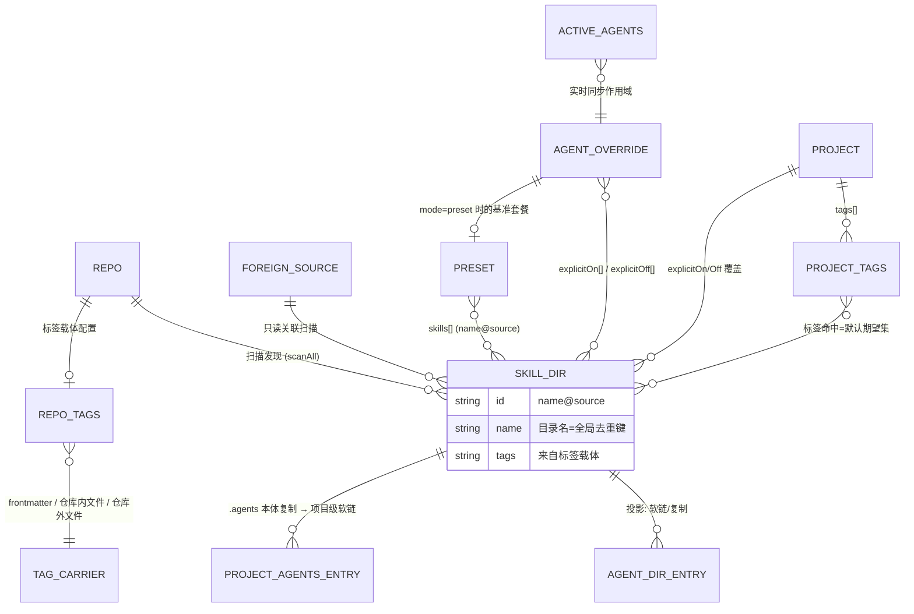
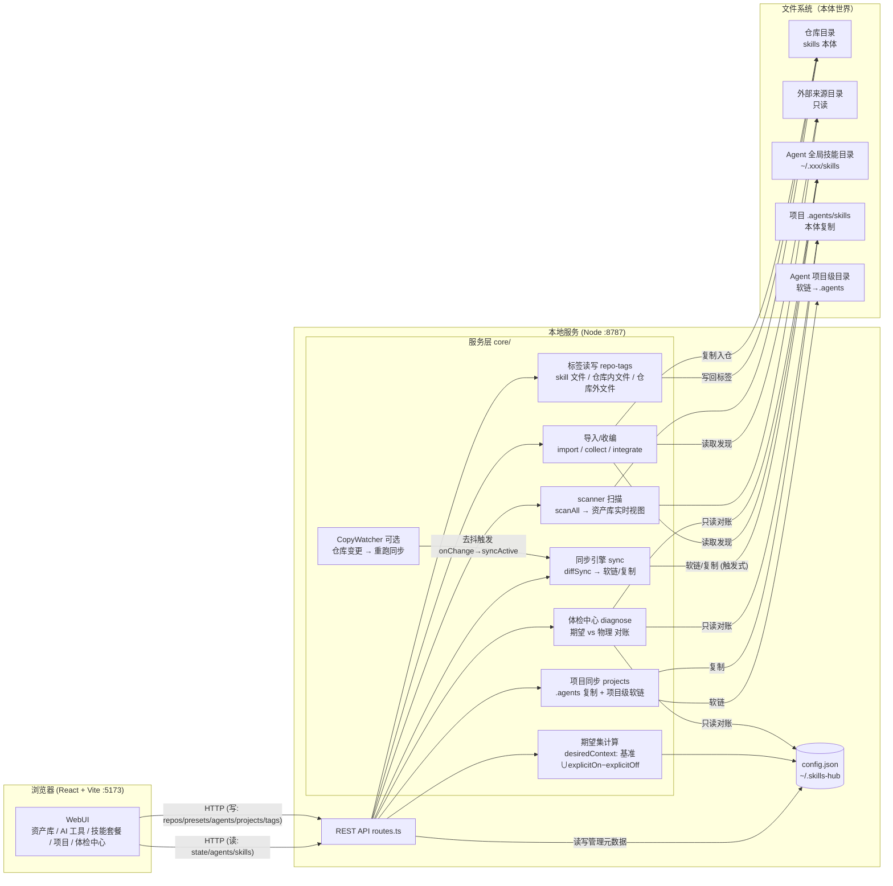
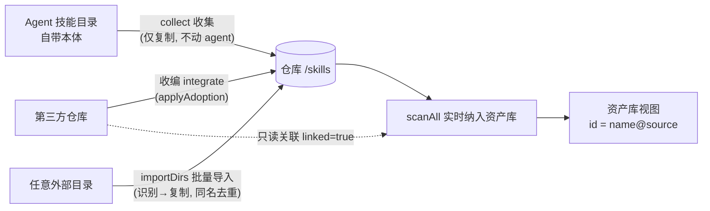
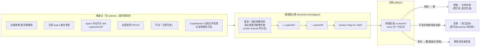
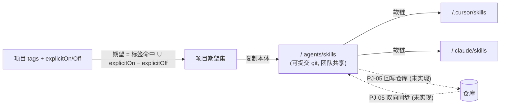

# Skills Hub 数据管理与数据流向示意图（v1 草案）

> 目的：把「让 skill 成为个人资产」的理念翻译成一张可讨论的数据模型 + 数据流图，对齐现状代码后，作为后续功能完善的基准。
> 现状对照范围：`PRD.md`、`README.md`、`server/src`（config/core/api 全部）、`client/src/App.tsx`。

---

## 0. 设计原则（理念 → 数据原则）

| 理念 | 落到数据上的原则 |
|------|----------------|
| 文件即本体 | skill 本体只存在于文件系统；config 只存「引用 + 管理信息」，永不复制本体 |
| 不被工具绑定 | 元数据不写私有格式：标签优先写 SKILL.md frontmatter / marketplace.json 等生态共识位置 |
| 唯一事实源 | **期望集（desired）由配置推导**；各 Agent / 项目目录只是期望集的「物理投影」 |
| 降低碎片化 | 同名 skill 以 `name` 归一化去重，一个目录名只对应一份投影 |
| 触发式同步 | 数据流全部由用户操作触发（激活/切换/修改/手动），非常驻（复制 watcher 可选） |

**一句话模型**：

```
配置(config.json) ──推导──▶ 期望集(desired) ──投影──▶ 物理目录(软链/复制)
     ▲                                                        │
     └──────────── 体检/诊断 diffSync 对账 ◀───────────────────┘
```

---

## 1. 数据资产盘点：两个世界

### 1.1 文件系统世界（本体，唯一可信副本）

| 位置 | 内容 | 谁写它 |
|------|------|--------|
| `<repo>/skills/<source?>/<name>/` | 仓库 skill 本体（flat / nested 布局） | 导入 import、收编 collect、用户手工/git |
| 外部来源目录（foreignSources） | 第三方 skill 本体（只读关联，不拷贝） | 上游/用户 |
| `~/.<agent>/skills/` | Agent 全局技能目录：**软链 / 复制 / 自带本体** | 同步引擎 sync |
| `<project>/.agents/skills/` | 项目技能本体（**复制**，可提交 git） | 项目同步 syncProject |
| `<project>/.<agent>/skills/` | Agent 项目级目录：**软链 → .agents** | 项目同步 syncProject |
| 标签载体 | SKILL.md frontmatter / 仓库内文件 / 仓库外文件 | PATCH /skills/:id 写回 |

### 1.2 config.json 世界（管理元数据，`~/.skills-hub/config.json`）

| 字段 | 语义 | 指向 |
|------|------|------|
| `repos[]` | 仓库注册表：id / path / layout / root / **tags 载体配置** | 文件目录 |
| `foreignSources[]` | 外部来源：id / path / layout / linked(只读 or 收编) | 文件目录 |
| `agents{}` | 每 Agent 覆盖：globalDir / sync(软链\|复制) / mode(preset\|manual) / preset / **explicitOn[] / explicitOff[]** | — |
| `activeAgents[]` | 活跃 Agent 集合（实时同步作用域） | agents key |
| `presets[]` | 套餐：skills[](name@来源) + tags[] + active | skill id |
| `skillMeta{}` | 兼容模式的本地标签（仓库未配 tags 载体时） | skill id |
| `projects[]` | 项目：path / tags[] / explicitOn[] / explicitOff[] | 文件目录 |
| `defaultSync` | 默认同步策略 | — |

> 关键点：config 里**没有 skill 本体的注册表**——资产库列表每次由 `scanAll` 实时扫描文件系统得出。文件系统本身就是资产清单。

---

## 2. 数据实体关系图



---

## 3. 总体数据流向图（架构 + 分层）



---

## 4. 核心数据流（四条关键链路）

### 4.1 资产入仓（Ingest：让资产从「散落」到「集中」）



- 去重键 = skill 目录名（name）；`name@来源` 允许跨来源重名共存于逻辑层，但**投影时按 name 归一化只落一份**。
- 收集（collect）目前只复制不动 Agent 目录；「收编后 Agent 改软链」（PRD IM-03）由前端「合并去重」两步手动完成。

### 4.2 期望集 → 触发式分发（核心链路：切到即用）



- 作用域：`touch()`（onChanged）只对 **activeAgents** 自动同步；非活跃 Agent 懒同步（进入详情页手动「立即生效」）。
- 投影幂等：重复执行 diff 为空即无操作（NFR-05）。

### 4.3 项目级链路（一套本体、多 Agent 共享）



- 标签是「投放策略」而非目录快照：标签变化 → 立即重投（沿用当前已投放 Agent 集合）。
- 投放对象（哪些 Agent 的项目目录建软链）**以目录结构为事实**，不写入 config。

### 4.4 标签链路（元数据的载体选择）

```mermaid
flowchart TB
    U[UI 打标签] --> Q{仓库配置了<br/>tags 载体?}
    Q -- "skill 文件" --> W1[写 SKILL.md frontmatter 顶层 tags<br/>随 git 版本化 · 推荐]
    Q -- "仓库内文件 / 仓库外文件" --> W2[写 marketplace.json<br/>plugins[].keywords<br/>与外部本体解耦]
    Q -- "未配置（自动）" --> W3[写 config.skillMeta<br/>仅本地 · 提示用户配置载体]
    W1 & W2 & W3 --> RD[读取优先级:<br/>repo.tags 载体为唯一基准<br/>否则 skillMeta → frontmatter 自带]
    RD --> USED["被三处消费:<br/>① 资产库过滤 ② 技能套餐关联 ③ 项目标签命中"]
```

---

## 5. 现状对照：图上发现的差距（讨论重点）

按「数据一致性风险 / PRD 未落地」两类，我对照代码梳理出以下差距：

| # | 发现 | 类型 | 建议 |
|---|------|------|------|
| G1 | **标签双基准漂移**：PATCH 写载体失败时静默回退写 `skillMeta`，且未配载体的仓库读 frontmatter 自带 tags——同一 skill 的标签可能同时存在三处（frontmatter / skillMeta / 载体文件），无对账 | 数据一致性 | 明确「单一基准 + 只读兜底」：载体配置后 skillMeta 只作只读迁移源，体检中心增加标签漂移检测 |
| G2 | **期望集标识混用 id 与 name**：`explicitOn` 有时存 `name@source` 有时存纯 name（`nameOf` 归一化兜底），跨来源同名 skill 的 explicitOn 指向可能随扫描顺序漂移 | 数据一致性 | 统一约定：配置层一律存 id（name@source），仅投影层归一化为 name；写入时归一化 |
| G3 | **回写仓库（PJ-05）未实现**：项目 `.agents` 修改无法 push 回仓库，双向同步缺失 | PRD 未落地 | 新增 `POST /projects/:id/push`（方向可选）+ UI 按钮 |
| G4 | **收编后未改软链（IM-03）**：collect 只复制，Agent 目录仍是本体，需手动两步「合并去重」 | PRD 未落地 | collect 增加 `replace: true`：复制入仓 → 原位置替换为软链 |
| G5 | **触发机制两套并存**：部分路由走 `touch()`，部分（presets PUT / activate、projects）显式调 `syncActive`，语义重复且覆盖面不一致 | 代码结构 | 统一为「所有结构性变更 → touch()」单出口 |
| G6 | **activeAgents 集合变更未做「加入即就位」校验**：AA-04 要求加入即同步，当前依赖 `touch()` 全量重跑（结果等价，但非活跃→活跃切换时无「就位」反馈） | 体验 | `PUT /activeAgents` 返回该 Agent 的同步 diff 摘要 |
| G7 | **CopyWatcher 只监听仓库**：复制模式下 Agent 目录里手工改动的副本、`.agents` 变更不在监听范围 | 边界 | 暂可接受（P3 再扩），图上标注清楚即可 |
| G8 | **TECH.md 为空**：架构文档缺失，本次图可作为其底稿 | 文档 | 讨论定稿后回填 TECH.md |

---

## 6. 建议的讨论议题（定稿前需拍板）

1. **标签基准**（G1）：是否确定「仓库配置载体后，载体即唯一基准，skillMeta 仅一次性迁移」？体检中心是否加「标签漂移」检查项？
2. **标识约定**（G2）：配置层统一存 `name@source`，是否接受？
3. **回写设计**（G3）：`.agents → 仓库` 回写的方向、冲突策略（仓库为基准覆盖 or 时间戳 or 手动逐个确认）？
4. **收编即软链**（G4）：collect 默认是否直接替换为软链，还是保持「收集」与「接管」两个动作？
5. **触发统一**（G5）：全部收敛到 touch() 单出口？
6. 优先级排序：建议 G1/G2（数据一致性）→ G4（核心体验）→ G3（P2 收尾）→ G5/G6。
